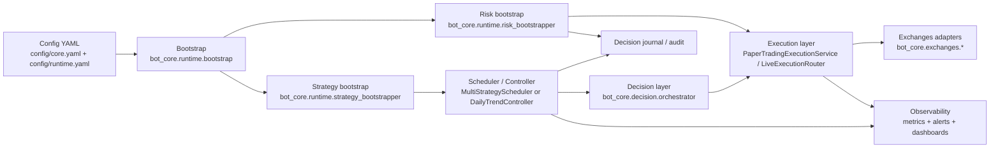

# Stage6 Acquisition / Architecture Package (technical due diligence)

> Cel dokumentu: umożliwić właścicielowi, kupcowi technicznemu i nowemu developerowi szybkie, uczciwe zrozumienie granic systemu na podstawie aktywnego kodu Stage6 (`bot_core/**`, `ui/**`, `config/**`).

## 1) High-level architecture (aktualny runtime)

### Co z diagramu wynika praktycznie
- Runtime jest składany przez bootstrap (nie przez jeden „monolit” konstrukcyjny), co ogranicza coupling i ułatwia testowanie granic pomiędzy modułami.
- Są dwie główne ścieżki uruchomienia: pipeline daily-trend i multi-strategy runtime.
- Warstwa execution jest jawnie przełączalna (paper/live), a warstwa risk jest podpinana przed egzekucją.

## 2) Module boundaries (granice modułów)

### A. Konfiguracja i kontrakty
- `bot_core.config` — modele konfiguracji i loader YAML do obiektów typed (`CoreConfig`, runtime settings, risk/observability/AI).
- `config/**` — środowiskowe i produktowe źródło prawdy (strategies, risk thresholds, exchange profile, observability).

**Boundary:** moduły downstream nie powinny parsować YAML bezpośrednio; dostają gotowe modele konfiguracyjne.

### B. Runtime orchestration
- `bot_core.runtime.bootstrap` — zestawia środowisko, adaptery, risk engine, compliance/secret/licensing hooks.
- `bot_core.runtime.pipeline` — buduje działające pipeline’y (`build_daily_trend_pipeline`, `build_multi_strategy_runtime`).
- `bot_core.runtime.*_bootstrapper` — wydzielone bootstrapy strategii, execution, risk i data source.

**Boundary:** runtime orchestration składa komponenty, ale nie implementuje ich core logiki domenowej.

### C. Strategie / decyzje
- `bot_core.strategies` — silniki strategii i katalog strategii.
- `bot_core.decision` — ocena kandydatów decyzji, scoring, model-quality fallback, bandit advisor.

**Boundary:** strategia produkuje sygnał/intent, decision warstwa ocenia/priorytetyzuje.

### D. Risk & guardrails
- `bot_core.risk` — profile ryzyka, pre-trade checks, guardrails strat/ekspozycji, snapshot stanu.

**Boundary:** risk zatwierdza/odrzuca wniosek transakcyjny przed execution.

### E. Execution & exchange integration
- `bot_core.execution` — paper execution i live router (retry/fallback/circuit-breaker/metryki).
- `bot_core.exchanges` — adaptery giełd i monitor zdrowia.

**Boundary:** execution nie zna szczegółów UI ani config loadera; operuje na kontraktach request/result/context.

### F. Observability / operations
- `bot_core.observability`, `bot_core.alerts`, `bot_core.monitoring`, `deploy/prometheus`, `deploy/grafana`.

**Boundary:** metryki i alerting są emitowane przez moduły domenowe, ale renderowane/transportowane osobno.

## 3) Kluczowy przepływ end-to-end: config → strategy → execution → risk → observability

## 3.1 Config
1. `PipelineConfigLoader.load_core_config` i `resolve_multi_strategy_scheduler` ładują i walidują config.
2. `build_daily_trend_pipeline` / `build_multi_strategy_runtime` wyznaczają effective strategy/controller/scheduler.

## 3.2 Strategy
1. `StrategyBootstrapper.collect_definitions` mapuje konfigurację na `StrategyDefinition` + metadata (risk hooks, capability, tags).
2. `StrategyBootstrapper.instantiate` tworzy runtime’owe instancje strategii.
3. Scheduler rejestruje cadence, warmup, max_signals i profile ryzyka per schedule.

## 3.3 Execution
1. `ExecutionBootstrapper.bootstrap_execution_service` wybiera paper lub live na podstawie runtime settings + środowiska.
2. W live używany jest `LiveExecutionRouter` z retry, fallback i circuit breakerem.

## 3.4 Risk
1. `RiskBootstrapper.bootstrap_context` inicjuje risk engine i wiąże go z bootstrap context.
2. `ThresholdRiskEngine.apply_pre_trade_checks` wykonuje kontrole limity/ekspozycja/leverage/guardrails.
3. Dodatkowe sygnały ochronne mogą ograniczać fallback execution przez metadata (`risk_allow_fallback_categories`).

## 3.5 Observability
1. `MetricsRegistry` publikuje prom-compatible metrics (counter/gauge/histogram).
2. Runtime alert router (`build_alert_channels`) składa kanały i audit log (in-memory lub file backend).
3. Deployment utrzymuje dashboardy i alert rules (`deploy/grafana/**`, `deploy/prometheus/**`).

## 4) Kluczowe bounded contexts

1. **Configuration & Environment Context**
   - modele konfiguracyjne, profile runtime/paper/live/cloud.
2. **Strategy Context**
   - generowanie sygnałów i polityki strategii per engine.
3. **Decision Intelligence Context**
   - AI inference, quality fallback, bandit recommendation, scoring.
4. **Risk Governance Context**
   - profile ryzyka, guardrails, decyzje approve/reject, stany konta/pozycji.
5. **Execution Routing Context**
   - translacja intentów na order flow, retry/fallback, exchange failover.
6. **Exchange Connectivity Context**
   - adaptery, health checks, streaming/REST feed.
7. **Observability & Alerting Context**
   - metryki, alerty, audyt alertów, SLO monitoring.
8. **Security & Licensing Context**
   - secret manager, podpisy, capability guards, HWID/license checks.
9. **Packaging & Offline Distribution Context**
   - OEM packaging, offline installer/profile release.

## 5) Najważniejsze ryzyka + mitigacje (z kodu)

| Ryzyko | Obserwacja w kodzie | Aktualna mitigacja | Co nadal boli |
|---|---|---|---|
| Złożoność runtime bootstrapu | `runtime/bootstrap.py` jest bardzo szeroki i obsługuje liczne optional dependencies | Wyodrębnione bootstrappery (`strategy/execution/risk/data`) i testy kontraktowe runtime | Nadal jeden ciężki punkt wejścia; koszt onboardingu i review pozostaje wysoki |
| Niezawodność live execution przy błędach giełdy | Live router ma retry/fallback/circuit-breaker i klasyfikację błędów | Metryki execution + fallback counters + fail-fast dla auth/API edge-cases | Wysoka konfiguracja i wiele ścieżek fallback zwiększają surface area regresji |
| Drift jakości modeli AI | Orchestrator ładuje raport jakości i potrafi rollbackować do baseline/fallback alias | `load_repository_inference` z kontrolą statusu `degraded` | Skuteczność zależy od jakości i aktualności raportów model quality |
| Ryzyko „silent degradation” obserwowalności | Alerting ma backend pamięciowy/file i opcjonalne kanały z secret loadingiem | Router alertów + audit log + throttle + dashboard/rules | Przy złej konfiguracji kanałów degradacja do in-memory może być niewidoczna operacyjnie |
| Granice backward compatibility | W kodzie są aliasy/fallbacki pod legacy testy i optional deps | Dzięki temu system zachowuje kompatybilność gałęzi/buildów | Narasta debt utrzymaniowy i niejednoznaczność „co jest kanoniczne” |

## 6) Opis operacyjny: co jest prod-minded vs. wymaga uwagi

### Prod-minded (już obecne)
- Runtime ma jawne tryby paper/live/cloud i policyjne capability checks przed uruchomieniem runtime.
- Execution live posiada mechanizmy resilience (retry/fallback/circuit breaker) oraz telemetrię.
- Risk jest osadzony jako twarda bramka przed-trade, a nie „opcjonalny callback”.
- Istnieje pełny tor observability (metryki, alerty, dashboardy, reguły prom).
- Repo zawiera packaging i offline distribution pod OEM (release-minded ścieżka dostaw).

### Wymaga uwagi przed pełnym „buyer-ready production scale”
- Dalsze odchudzanie `runtime/bootstrap.py` i zamykanie legacy import fallbacków.
- Dookreślenie i egzekucja „canonical path” dla optional dependency behavior (light vs full builds).
- Ograniczanie konfiguracyjnej złożoności live routing policy (redukcja edge-case matrix).
- Bardziej twarde runbooki dla degradacji alertingu do backendu pamięciowego.

## 7) Co już zrefaktorowane vs. dalsza praca

### Już zrefaktorowane / wyodrębnione
- Bootstrap pipeline został pocięty na dedykowane komponenty:
  - `PipelineConfigLoader`
  - `StrategyBootstrapper`
  - `ExecutionBootstrapper`
  - `RiskBootstrapper`
  - `DataSourceBootstrapper`
- Runtime zachowuje kompatybilność i testowalność przez kontrakty (`BootstrapContext`, dedykowane testy runtime).

### Dalsza praca (narrow backlog)
1. Kontynuować dekompozycję `runtime/bootstrap.py` na mniejsze facady domenowe.
2. Ograniczyć techniczne „legacy shims” tam, gdzie pokrycie testowe potwierdza brak konsumentów.
3. Ujednolicić naming/kontrakty między ścieżką daily-trend a multi-strategy w dokumentacji operacyjnej.
4. Dodać metryki health dla alert backend selection (żeby degradacja in-memory była zawsze sygnalizowana).

---

## Evidence base (na czym opiera się ten pakiet)

Przepływy i granice zostały opisane bez zgadywania, wyłącznie z aktywnego kodu i testów Stage6.

### Evidence index (representative references)
- **Runtime bootstrap + wiring:** `bot_core/runtime/bootstrap.py`, `bot_core/runtime/pipeline.py`.
- **Config loading / scheduler selection:** `bot_core/runtime/pipeline_config_loader.py`, `bot_core/config/loader.py`.
- **Strategy bootstrap boundary:** `bot_core/runtime/strategy_bootstrapper.py`.
- **Execution boundary + live routing resilience:** `bot_core/runtime/execution_bootstrapper.py`, `bot_core/execution/live_router.py`.
- **Risk boundary:** `bot_core/runtime/risk_bootstrapper.py`, `bot_core/risk/engine.py`.
- **Observability boundary:** implementacja `build_alert_channels` w `bot_core/runtime/observability.py`, wrapper/re-export w `bot_core/runtime/bootstrap.py`, metryki w `bot_core/observability/metrics.py`.
- **Drift-guard tests (docs + lightweight contracts):** `tests/docs/test_acquisition_package_contract.py`, `tests/docs/test_marketing_links.py`, `tests/test_no_archive_imports.py`, `tests/test_runtime_paths.py`.
