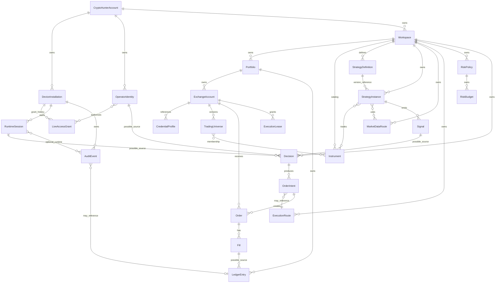

# CryptoHunter M0.2 — canonical domain vocabulary

## Status M0.2

Status: accepted architecture contract draft for M0.2 under audit. Baseline commit: `7d68ff5c6647509de1c97759114919858075f062`.

This document is the canonical vocabulary layer above M0.1 inventory. It does not change runtime behavior.

## Scope and non-goals

- Define stable product vocabulary for Core, GUI, Tray Agent, persistence, IPC/gRPC, exchanges, strategies, audit and future SaaS.
- Non-goals: runtime refactor, enum changes, configuration changes, UUIDv7 implementation, API calls, Live execution, legacy removal.

## Glossary

- **CryptoHunterAccount** (`account_id`, `acct_<uuidv7>`): root SaaS/customer account Parent: none. Secret policy: must not contain secrets.
- **DeviceInstallation** (`device_installation_id`, `dev_<uuidv7>`): installed device record Parent: CryptoHunterAccount. Secret policy: must not contain secrets.
- **OperatorIdentity** (`operator_id`, `op_<uuidv7>`): human/operator identity Parent: CryptoHunterAccount. Secret policy: must not contain secrets.
- **LiveAccessGrant** (`live_access_grant_id`, `lgrant_<uuidv7>`): durable protected installation authorization for Live; independent from active environment and kill switch state Parent: DeviceInstallation. Secret policy: does not contain plaintext exchange secrets; contains or references signature/integrity proof and must be protected from manual editing.
- **Workspace** (`workspace_id`, `ws_<uuidv7>`): product workspace boundary Parent: CryptoHunterAccount. Secret policy: must not contain secrets.
- **Portfolio** (`portfolio_id`, `port_<uuidv7>`): portfolio aggregation boundary Parent: Workspace. Secret policy: must not contain secrets.
- **ExchangeAccount** (`exchange_account_id`, `xacc_<uuidv7>`): logical venue account for one exchange/environment/market type Parent: Portfolio. Secret policy: must not contain secrets.
- **CredentialProfile** (`credential_profile_id`, `cred_<uuidv7>`): secure store reference profile Parent: ExchangeAccount. Secret policy: may store only secure-store references; never plaintext secrets.
- **TradingUniverse** (`trading_universe_id`, `univ_<uuidv7>`): versioned set of tradable instruments Parent: ExchangeAccount. Secret policy: must not contain secrets.
- **Instrument** (`instrument_id`, `instr_<uuidv7>`): venue/market specific instrument identity Parent: Workspace. Secret policy: must not contain secrets. Identity dimensions: exchange_id, environment, market_type, venue_symbol.
- **StrategyDefinition** (`strategy_definition_id`, `sdef_<uuidv7>`): strategy type and version definition Parent: Workspace. Secret policy: must not contain secrets.
- **StrategyInstance** (`strategy_instance_id`, `sinst_<uuidv7>`): configured/running strategy instance Parent: Workspace. Secret policy: must not contain secrets.
- **MarketDataRoute** (`market_data_route_id`, `mdr_<uuidv7>`): market data routing policy Parent: Workspace. Secret policy: must not contain secrets.
- **ExecutionRoute** (`execution_route_id`, `xroute_<uuidv7>`): execution venue/account routing policy Parent: Workspace. Secret policy: must not contain secrets.
- **RiskPolicy** (`risk_policy_id`, `rpol_<uuidv7>`): risk rule set Parent: Workspace. Secret policy: must not contain secrets.
- **RiskBudget** (`risk_budget_id`, `rbud_<uuidv7>`): allocated risk budget Parent: RiskPolicy. Secret policy: must not contain secrets.
- **ExecutionLease** (`execution_lease_id`, `lease_<uuidv7>`): exclusive/authorized execution lease Parent: ExchangeAccount. Secret policy: must not contain secrets.
- **Signal** (`signal_id`, `sig_<uuidv7>`): strategy-produced signal event Parent: StrategyInstance. Secret policy: must not contain secrets.
- **Decision** (`decision_id`, `dec_<uuidv7>`): risk/execution decision record Parent: Workspace. Secret policy: must not contain secrets. Source types: strategy_signal, operator_action, risk_system, recovery_policy, reconciliation_import; exactly one explicit provenance source is required.
- **OrderIntent** (`order_intent_id`, `oint_<uuidv7>`): internal desired order before venue placement Parent: Decision. Secret policy: must not contain secrets.
- **Order** (`order_id`, `ord_<uuidv7>`): internal order lifecycle record Parent: ExchangeAccount. Secret policy: must not contain secrets.
- **Fill** (`fill_id`, `fill_<uuidv7>`): execution fill event Parent: Order. Secret policy: must not contain secrets.
- **LedgerEntry** (`ledger_entry_id`, `led_<uuidv7>`): immutable accounting entry Parent: Portfolio. Secret policy: must not contain secrets. Append-only immutable entry with source_event_type/source_event_id; may exist without Fill.
- **RuntimeSession** (`runtime_session_id`, `run_<uuidv7>`): core runtime process/session Parent: DeviceInstallation. Secret policy: must not contain secrets.
- **AuditEvent** (`audit_event_id`, `evt_<uuidv7>`): immutable audit/security/runtime event Parent: DeviceInstallation. Secret policy: must not contain secrets. May exist without RuntimeSession and audits pre-Core security/device/license events.

## Canonical public trading environments

| Environment | Meaning |
| --- | --- |
| PAPER | Local execution engine, no private trading API, own historical/replay/public data, simulated orders and fills. |
| TESTNET | Real network integration against exchange testnet/sandbox endpoints, testnet credentials and test orders. |
| LIVE | Real funds and production endpoints; requires product capability, durable LiveAccessGrant and safety gates. |

Fail-closed target: missing environment must not mean LIVE. Future user product default is TESTNET; explicitly local execution default may be PAPER.

## Deprecated aliases and mappings

| Term | Canonical handling | Migration rule | Evidence |
| --- | --- | --- | --- |
| `demo` | deprecated alias requiring context-specific migration | Do not rewrite blindly; classify old Demo as fixture, PAPER simulation, or exchange TESTNET before migration | bot_core/runtime/frontend.py, docs/architecture/desktop_shell_plan.md |
| `sandbox` | adapter endpoint classification; public target TESTNET | Keep sandbox only in adapter endpoint metadata/migration; expose TESTNET publicly | bot_core/exchanges/manager.py, config/environments/exchange_modes.yaml |
| `production/prod` | legacy alias LIVE only in migration layer | Reject outside migration/import normalization after future change | bot_core/runtime/frontend.py |
| `primary` | legacy route/account alias; not durable ID | Replace with ExchangeAccount/ExecutionRoute IDs in future migration | bot_core/runtime/frontend.py, bot_core/execution/execution_service.py, bot_core/runtime/journal.py |
| `Environment default LIVE` | legacy risk: missing env must not imply LIVE | Future migration to fail closed TESTNET or local PAPER by context | bot_core/exchanges/base.py |
| `Instrument string` | Instrument ID plus external venue_symbol | Future schema separates instr_ ID from venue_symbol | bot_core/exchanges/base.py, proto/trading.proto |

## Independent state axes

- **product_capability**: LIVE_CAPABLE, LIVE_NOT_CAPABLE.
- **live_access_grant**: ABSENT, GRANTED, REVOKED, SUSPENDED.
- **active_trading_environment**: PAPER, TESTNET, LIVE.
- **runtime_state**: STOPPED, CONNECTING, SYNCHRONIZING, READY, RUNNING, PAUSED, DEGRADED, EMERGENCY_STOPPED.
- **kill_switch_state**: ARMED, TRIGGERED, RESET_PENDING.
- **operator_interface_authentication**: LOCKED, AUTHENTICATED.
- **exchange_account_connection_state**: DISCONNECTED, CONNECTING, SYNCHRONIZING, ONLINE, DEGRADED, BLOCKED.
- **execution_authorization**: READ_ONLY, ORDER_ENTRY_ALLOWED, BLOCKED_BY_POLICY, BLOCKED_BY_KILL_SWITCH, BLOCKED_BY_LEASE, BLOCKED_BY_RECONCILIATION.

## Entity model

| Entity | ID field | Prefix | Parent | Persistent | SaaS sync candidate | Secret policy | Legacy names/conflicts |
| --- | --- | --- | --- | --- | --- | --- | --- |
| CryptoHunterAccount | `account_id` | `acct_` | none | True | True | must not contain secrets | none recorded |
| DeviceInstallation | `device_installation_id` | `dev_` | CryptoHunterAccount | True | True | must not contain secrets | none recorded |
| OperatorIdentity | `operator_id` | `op_` | CryptoHunterAccount | True | True | must not contain secrets | none recorded |
| LiveAccessGrant | `live_access_grant_id` | `lgrant_` | DeviceInstallation | True | True | does not contain plaintext exchange secrets; contains or references signature/integrity proof and must be protected from manual editing | none recorded |
| Workspace | `workspace_id` | `ws_` | CryptoHunterAccount | True | True | must not contain secrets | none recorded |
| Portfolio | `portfolio_id` | `port_` | Workspace | True | True | must not contain secrets | none recorded |
| ExchangeAccount | `exchange_account_id` | `xacc_` | Portfolio | True | True | must not contain secrets | primary |
| CredentialProfile | `credential_profile_id` | `cred_` | ExchangeAccount | True | False | may store only secure-store references; never plaintext secrets | none recorded |
| TradingUniverse | `trading_universe_id` | `univ_` | ExchangeAccount | True | True | must not contain secrets | none recorded |
| Instrument | `instrument_id` | `instr_` | Workspace | True | True | must not contain secrets | symbol string |
| StrategyDefinition | `strategy_definition_id` | `sdef_` | Workspace | True | True | must not contain secrets | none recorded |
| StrategyInstance | `strategy_instance_id` | `sinst_` | Workspace | True | True | must not contain secrets | none recorded |
| MarketDataRoute | `market_data_route_id` | `mdr_` | Workspace | True | True | must not contain secrets | none recorded |
| ExecutionRoute | `execution_route_id` | `xroute_` | Workspace | True | True | must not contain secrets | primary |
| RiskPolicy | `risk_policy_id` | `rpol_` | Workspace | True | True | must not contain secrets | none recorded |
| RiskBudget | `risk_budget_id` | `rbud_` | RiskPolicy | True | True | must not contain secrets | none recorded |
| ExecutionLease | `execution_lease_id` | `lease_` | ExchangeAccount | True | True | must not contain secrets | none recorded |
| Signal | `signal_id` | `sig_` | StrategyInstance | True | True | must not contain secrets | none recorded |
| Decision | `decision_id` | `dec_` | Workspace | True | True | must not contain secrets | none recorded |
| OrderIntent | `order_intent_id` | `oint_` | Decision | True | True | must not contain secrets | none recorded |
| Order | `order_id` | `ord_` | ExchangeAccount | True | True | must not contain secrets | none recorded |
| Fill | `fill_id` | `fill_` | Order | True | True | must not contain secrets | OrderResult |
| LedgerEntry | `ledger_entry_id` | `led_` | Portfolio | True | True | must not contain secrets | none recorded |
| RuntimeSession | `runtime_session_id` | `run_` | DeviceInstallation | True | True | must not contain secrets | none recorded |
| AuditEvent | `audit_event_id` | `evt_` | DeviceInstallation | True | True | must not contain secrets | none recorded |

### Instrument identity rule

- Instrument ID is durable and independent from TradingUniverse versions.
- A new TradingUniverse version does not create a new Instrument ID.
- Binance Spot BTC/USDT, Binance Futures BTC/USDT and OKX Spot BTC/USDT are separate Instruments because identity dimensions are `exchange_id`, `environment`, `market_type` and `venue_symbol`.
- `venue_symbol` remains an external identifier, not an internal CryptoHunter ID.

### Decision source rule

- Decision is owned by Workspace, not Signal, so manual terminal, operator, risk-system, recovery and reconciliation decisions do not need synthetic Signal rows.
- Supported `decision_source_types`: `strategy_signal`, `operator_action`, `risk_system`, `recovery_policy`, `reconciliation_import`.
- Optional source references: `signal_id`, `operator_id`, `runtime_session_id`, `source_event_id`.
- Every Decision must have exactly one explicit provenance source.

### LedgerEntry rule

- LedgerEntry is owned by Portfolio, immutable and append-only.
- LedgerEntry links to exactly one source through `source_event_type` and `source_event_id`.
- Optional references are `exchange_account_id`, `strategy_instance_id`, `order_id` and `fill_id`.
- Allowed source event types: `fill`, `fee`, `funding`, `interest`, `deposit`, `withdrawal`, `internal_transfer`, `capital_reservation`, `capital_release`, `realized_pnl`, `reconciliation_correction`.
- Fill can be a possible source, but LedgerEntry can also exist for fee, funding, interest, deposit, withdrawal, internal transfer, reservation/release, realized PnL or reconciliation correction.

### AuditEvent rule

- AuditEvent is owned by DeviceInstallation and may exist without RuntimeSession.
- Optional references: `runtime_session_id`, `operator_id`, `workspace_id`, `exchange_account_id`, `order_id`, `ledger_entry_id`.
- Audit categories: `authentication`, `authorization`, `configuration`, `credential_management`, `device_management`, `licensing`, `live_activation`, `runtime`, `trading`, `risk`, `recovery`, `update`, `security`.
- Wizard, login, PIN, biometric, licensing, API-key-management, update and device rebind events must be auditable before Core starts.
- If an event is created while Core is running, `runtime_session_id` should be recorded.
- AuditEvent remains immutable, append-only and cannot contain secrets or biometric data.

## Supported lifecycle flows

Automated strategy flow: `StrategyInstance → Signal → Decision → OrderIntent → Order → Fill → LedgerEntry`. This is a supported automated flow, not the only valid decision flow.

Manual/operator flow: `OperatorIdentity → Decision → OrderIntent → Order → Fill → LedgerEntry`.

System/recovery/reconciliation flows may start at `Decision` with explicit `runtime_session_id` or `source_event_id` provenance.

## Relationship diagram

## Relationship cardinality

- CryptoHunterAccount → DeviceInstallation: one_to_many.
- CryptoHunterAccount → OperatorIdentity: one_to_many.
- CryptoHunterAccount → Workspace: one_to_many.
- Workspace → Portfolio: one_to_many.
- ExchangeAccount → TradingUniverse: one_to_many_versioned.
- StrategyInstance → ExchangeAccount: many_to_many_assignments.
- StrategyInstance → Instrument: many_to_many_assignments.
- StrategyInstance → MarketDataRoute: many_to_many.
- OrderIntent → ExecutionRoute: optional_policy_reference.
- ExchangeAccount → Order: one_to_many.
- Order → Fill: one_to_many.
- ExchangeAccount → ExecutionLease: one_to_many_per_scope.
- Portfolio → ExchangeAccount: one_to_many.
- Workspace → Instrument: one_to_many_catalog.
- TradingUniverse → Instrument: many_to_many_membership.
- Workspace → StrategyInstance: one_to_many.
- StrategyDefinition → StrategyInstance: one_to_many_reference.
- DeviceInstallation → LiveAccessGrant: one_to_many_history.
- OperatorIdentity → LiveAccessGrant: authorization_reference.
- Portfolio → LedgerEntry: one_to_many.
- StrategyInstance → Signal: one_to_many.
- Decision → OrderIntent: one_to_many.
- OrderIntent → Order: one_to_many.
- Fill → LedgerEntry: one_to_many_possible_source.
- AuditEvent → LedgerEntry: optional_reference.
- ExchangeAccount → CredentialProfile: one_to_many.
- Workspace → MarketDataRoute: one_to_many.
- Workspace → ExecutionRoute: one_to_many.
- Workspace → RiskPolicy: one_to_many.
- RiskPolicy → RiskBudget: one_to_many.
- DeviceInstallation → RuntimeSession: one_to_many.
- Workspace → StrategyDefinition: one_to_many.
- Workspace → Decision: one_to_many.
- Signal → Decision: one_to_many_possible_source.
- OperatorIdentity → Decision: one_to_many_possible_source.
- RuntimeSession → Decision: one_to_many_possible_source.
- DeviceInstallation → AuditEvent: one_to_many.
- RuntimeSession → AuditEvent: optional_runtime_reference.

## Identifier policy

Target durable ID format: `<prefix>_<uuidv7>`. No generator is implemented in M0.2.

UUIDv7 regex: `^[a-z][a-z0-9]*_[0-9a-f]{8}-[0-9a-f]{4}-7[0-9a-f]{3}-[89ab][0-9a-f]{3}-[0-9a-f]{12}$`.

- lowercase.
- stable unique entity prefix.
- no usernames/exchanges/symbols/secrets.
- immutable after rename.
- display names stored separately.
- safe for JSON SQLite Protobuf logs API.
- legacy strings migrated by explicit mapping.
- never derive durable ID from name.

Frozen prefixes: `acct_`, `dev_`, `op_`, `lgrant_`, `ws_`, `port_`, `xacc_`, `cred_`, `univ_`, `instr_`, `sdef_`, `sinst_`, `mdr_`, `xroute_`, `rpol_`, `rbud_`, `lease_`, `sig_`, `dec_`, `oint_`, `ord_`, `fill_`, `led_`, `run_`, `evt_`.

## External vs internal identifiers

External identifiers are not CryptoHunter IDs and must not be mixed with internal IDs: `exchange_id`, `venue_account_reference`, `venue_symbol`, `venue_order_id`, `venue_trade_id`.

## Invariants

- A valid operator password cannot bypass missing Live product capability.
- Active trading environment does not become LIVE before ProductCapability, LiveAccessGrant and safety gates pass.
- LiveAccessGrant and kill switch state are independent.
- Triggered kill switch does not delete durable Live grant but blocks execution authorization.
- Restart does not reset a triggered kill switch.
- Closing GUI does not change Core active environment or runtime state.
- Locked GUI does not necessarily stop Core.
- One unavailable exchange account does not automatically change environment for other accounts.
- Missing ExecutionLease blocks order entry but not reads or reconciliation.
- StrategyInstance stores a durable reference to the StrategyDefinition version used for configuration or runtime and strategy history is not automatically deleted when a definition is updated or removed.
- At most one currently active LiveAccessGrant applies to a given installation/policy scope; grants may be revoked or suspended without changing historical records; absence of a grant blocks LIVE but not PAPER or TESTNET.
- For a given ExchangeAccount and execution scope at most one ExecutionLease may be active; expired or released leases remain in history; missing active lease blocks order entry but not reads or reconciliation.
- Order cannot be created without a source OrderIntent except during explicitly marked migration or reconciliation import; every exception must include provenance.
- Every Decision must have exactly one explicit source/provenance; strategy_signal requires signal_id; operator_action requires operator_id; recovery_policy and reconciliation_import require runtime_session_id or explicit source_event_id; Decision must not create a synthetic Signal only to satisfy ownership.
- The StrategyInstance to Signal to Decision to OrderIntent to Order to Fill to LedgerEntry path is a supported automated lifecycle, not the only valid decision flow.
- The OperatorIdentity to Decision to OrderIntent to Order to Fill to LedgerEntry path is the supported manual/operator lifecycle.
- AuditEvent may exist without RuntimeSession.
- Wizard, login, PIN, biometric, licensing, API-key-management, update and device-rebind events must be auditable before Core starts.
- If an AuditEvent is created while Core is running, runtime_session_id should be recorded.
- AuditEvent is immutable and append-only.
- AuditEvent must not contain secrets or biometric data.

## Security boundaries

- CredentialProfile stores only secure-store references, not plaintext API keys.
- Saved secrets, API key values, passphrases, private TLS keys and recovery tokens must not return to QML after save.
- Internal IDs and external non-secret venue IDs may appear in logs; secrets and credential material must not.
- Biometrics and PIN are not DeviceFingerprint.
- DeviceFingerprint is not an API key.
- Operator authentication is not execution authorization.
- Online SaaS account cannot be a critical dependency for an already running Core.
- Live grant cannot be a normal editable boolean.
- Environment name alone must not choose arbitrary endpoint; adapter endpoint policy must also validate.
- Decision provenance is explicit and must not be satisfied by creating synthetic Signal records.
- AuditEvent records pre-Core and Core runtime security events without plaintext secrets or biometric data.

## Conflicts with current code

| Term | Current meanings | Canonical target | Evidence |
| --- | --- | --- | --- |
| `demo` | frontend maps demo to TESTNET; docs use demo→paper→live pipeline | deprecated alias requiring context-specific migration | bot_core/runtime/frontend.py, docs/architecture/desktop_shell_plan.md |
| `sandbox` | adapter endpoint classification through testnet/sandbox helpers; not a product-wide environment | adapter endpoint classification; public target TESTNET | bot_core/exchanges/manager.py, config/environments/exchange_modes.yaml |
| `production/prod` | frontend accepts prod/production as LIVE aliases | legacy alias LIVE only in migration layer | bot_core/runtime/frontend.py |
| `primary` | frontend bootstrap adapter name; live default_route fallback and journal fields primary_exchange | legacy route/account alias; not durable ID | bot_core/runtime/frontend.py, bot_core/execution/execution_service.py, bot_core/runtime/journal.py |
| `Environment default LIVE` | ExchangeCredentials defaults environment to LIVE | legacy risk: missing env must not imply LIVE | bot_core/exchanges/base.py |
| `Instrument string` | OrderRequest/proto use exchange+symbol/venue_symbol strings | Instrument ID plus external venue_symbol | bot_core/exchanges/base.py, proto/trading.proto |

## Future migrations (not implemented in M0.2)

- Replace primary/default route aliases with ExecutionRoute and ExchangeAccount IDs.
- Migrate legacy demo values only after classifying each occurrence as fixture, PAPER or exchange TESTNET.
- Restrict prod/production aliases to migration import layers.
- Change missing environment handling to fail closed without changing existing runtime defaults in this PR.
- Split Instrument IDs from plain venue symbols in IPC, persistence and UI read models.
- Preserve StrategyInstance history when StrategyDefinition versions are updated or removed.
- Keep LedgerEntry as Portfolio-owned append-only accounting entries rather than Fill-owned rows.
- Preserve manual/system/recovery/reconciliation Decision flows without synthetic Signal records.
- Preserve pre-Core AuditEvents without requiring RuntimeSession rows.

## Unresolved questions for later M0

- Exact SQLite physical schema and migration sequence.
- LiveAccessGrant storage and signing format.
- Final Core/background/tray lifecycle contract.
- Strategy assignment schema for account–instrument pairs.
- SaaS synchronization and offline conflict-resolution policy.

## Evidence paths

- `docs/architecture/cryptohunter_product_architecture/current_state_inventory.md`
- `docs/architecture/cryptohunter_product_architecture/current_state_inventory.json`
- `bot_core/exchanges/base.py`
- `bot_core/runtime/frontend.py`
- `bot_core/runtime/journal.py`
- `bot_core/runtime/multi_strategy_scheduler.py`
- `bot_core/execution/live_router.py`
- `bot_core/execution/execution_service.py`
- `bot_core/config`
- `bot_core/security`
- `bot_core/risk`
- `config/core.yaml`
- `config/environments/exchange_modes.yaml`
- `ui/config/preview_local.yaml`
- `proto/trading.proto`
- `docs/ARCHITECTURE.md`
- `docs/architecture/phase1_foundation.md`
- `docs/architecture/desktop_shell_plan.md`
