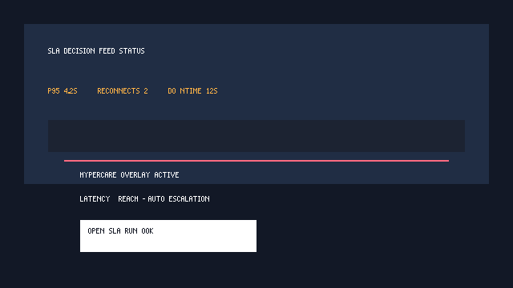

# Runbook SLA decision feedu

Ten runbook opisuje, jak reagować na degradację decision feedu raportowaną przez `RuntimeService`, panel SLA w PySide6 oraz pipeline `grpc-feed-integration`.

## Progi i konfiguracja
- Progi ostrzegawcze/krytyczne definiujemy w `observability.feed_sla` (`config/runtime.yaml`).
- Zmienne `BOT_CORE_UI_FEED_LATENCY_P95_WARNING_MS`, `BOT_CORE_UI_FEED_LATENCY_P95_CRITICAL_MS`, `BOT_CORE_UI_FEED_RECONNECT_WARNING`, `BOT_CORE_UI_FEED_DOWNTIME_WARNING_SECONDS` pozwalają nadpisać wartości w środowisku.
- HyperCare webhook/Signal konfigurujemy przez standardowe kanały alertowe lub zmienną `BOT_CORE_UI_FEED_HYPERCARE_WEBHOOK` – każdy alert SLA trafi automatycznie do routera `UiTelemetryAlertSink` oraz JSONL `logs/ui_telemetry_alerts.jsonl`.

## Reakcja w UI
1. **Żółta nakładka** – `latency_state == warning`. Panel SLA pokazuje ostrzeżenie, a przyciski pozwalają otworzyć runbook i ręcznie zalogować eskalację.
2. **Czerwona nakładka** – `latency_state == critical`. UI wymusza eskalację do HyperCare (alert w `reportController.logOperationalAlert`) i prezentuje ostatnie wartości `p95`, `reconnects`, `downtime` osobno dla gRPC i fallbacku (`feedHealth.transports`).
3. Po odzyskaniu parametrów `RuntimeService` wysyła event `recovered` – overlay znika, a log operacyjny jest uzupełniany komentarzem „recovered”.

## Pipeline i artefakty
- Job `grpc-feed-integration` uruchamia pełny zestaw testów degradacji (`tests/integration/test_grpc_transport.py`) i zatrzymuje release, jeżeli `p95_ms > latency_warning_ms`, `reconnects > reconnects_warning` lub `downtime_seconds > downtime_warning_seconds`.
- Artefakt `decision-feed-metrics` zawiera snapshot `reports/ci/decision_feed_metrics.json` (p50/p95, reconnecty, downtime, breakdown transportów).
- Artefakt `decision-feed-alerts` udostępnia `reports/ci/decision_feed_alerts.json` oraz `logs/ui_telemetry_alerts.jsonl`, dzięki czemu HyperCare może szybko odtworzyć linię czasu incydentu.

## Procedura eskalacji
1. Sprawdź kartę SLA w RuntimeOverview (PySide6). Zwróć uwagę na różnice między transportem gRPC a fallbackiem (`feedHealth.transports`).
2. Otwórz runbook (przycisk „Otwórz runbook SLA”) i wykonaj odpowiednią checklistę HyperCare.
3. Jeśli overlay jest czerwony – upewnij się, że alert trafił do kanałów HyperCare (Signal/webhook). W razie potrzeby kliknij „Zaloguj eskalację”, aby dopisać wpis do `reportController`.
4. Monitoruj panel do momentu powrotu do stanu „OK”. Po odzyskaniu SLO zarchiwizuj artefakty (`decision-feed-metrics`, `decision-feed-alerts`) w decision journalu.

## Lokalna weryfikacja SLA
1. Uruchom `pytest tests/integration/test_grpc_transport.py -k feed_health_reports_grpc_and_fallback_breakdown` aby potwierdzić raportowanie p50/p95, reconnectów i downtime na obu transportach.
2. Sprawdź integrację HyperCare: `pytest tests/runtime/test_metrics_alerts.py -k hypercare`. Test wykorzystuje zmienną `BOT_CORE_UI_FEED_HYPERCARE_WEBHOOK` i symuluje eskalację webhookową.
3. Do szybkiej inspekcji UI możesz wystartować `python -m ui.backend.runtime_service --mock-feed` oraz `python -m ui.app --offline` z ustawionym `QT_QPA_PLATFORM=offscreen`. Pozwoli to zobaczyć overlay bez pełnego środowiska desktopowego.
4. Aby wygenerować świeży screenshot, uruchom `pytest tests/ui/test_runtime_overview.py::test_runtime_overview_cards_react_to_live_signals -q`. Fixture `qml_diagnostics` zapisze PNG do `var/qml_diagnostics/screenshots/`. Następnie przekonwertuj go na plik SVG (wymagany przez zasady „bez binarek”) poleceniem `python scripts/png_to_svg_data_uri.py var/qml_diagnostics/screenshots/<nazwa_pliku>.png docs/images/feed_sla_overlay.svg --title "Panel SLA PySide6"`.
