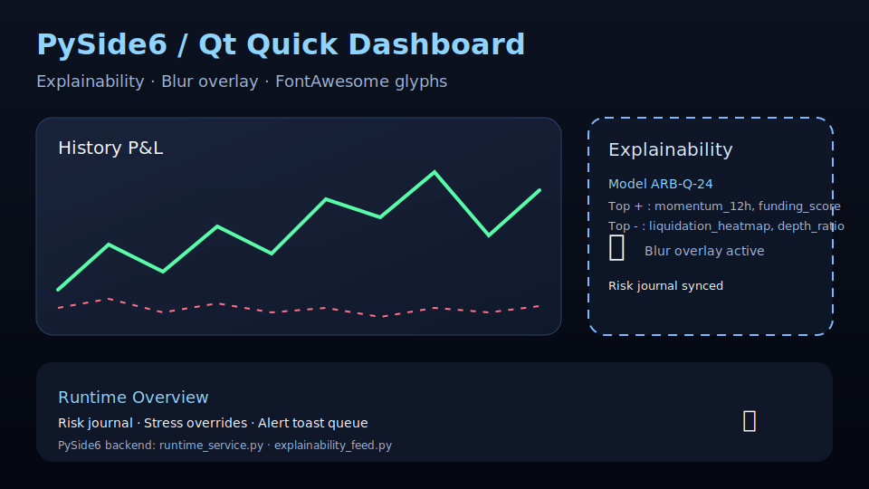

# Powłoka desktopowa PySide6/QML

Aktualny klient desktopowy powstaje w Pythonie (PySide6/PyQt6) i ładuje QML z
`ui/qml/**`. Cała logika biznesowa żyje w modułach `bot_core.*`, natomiast UI
skupia się na prezentacji danych i konfiguracji runtime. Historia wariantu
C++ jest utrzymywana wyłącznie w `archive/ui_cpp_preserved.md`.

## Podgląd blur + FontAwesome



* Efekty rozmycia bazują na komponencie `FrostedGlass.qml` i są włączone we
  wszystkich kartach dashboardu oraz panelach trybów pracy. Komponent stosuje
  `ShaderEffectSource`, maskę hałasu oraz parametry intensywności/offsetów,
  dzięki czemu blur zachowuje się identycznie w trybach 60/120 Hz.【F:ui/qml/design-system/FrostedGlass.qml†L1-L64】
* Ikony FontAwesome są ładowane z `ui/assets/fonts/README.md` poprzez
  `FontAwesomeData.js`. PySide6 rejestruje dane w pamięci i udostępnia je w QML
  przez komponent `Icon.qml`, więc nie ma potrzeby bundlowania dodatkowych
  czcionek systemowych.【F:ui/assets/fonts/README.md†L3-L12】【F:ui/qml/design-system/Icon.qml†L1-L57】

## Szybki start

1. Uruchom stub gRPC z datasetem multi-asset: `python
   scripts/run_trading_stub_server.py --dataset
   data/trading_stub/datasets/multi_asset_performance.yaml --stream-repeat
   --stream-interval 0.25 --enable-metrics --metrics-jsonl
   artifacts/metrics.jsonl`.
2. W drugim terminalu wystartuj klienta PySide6: `python -m ui.pyside_app
   --config ui/config/example.yaml --endpoint 127.0.0.1:50061 --symbol BTC/USDT
   --exchange BINANCE --fps-target 120 --metrics-endpoint 127.0.0.1:50061`.
3. Kreator pierwszego uruchomienia przeprowadzi Cię przez aktywację licencji,
   onboarding strategii i ustawienie presetu chmury. Wszystkie kontrolery są
   wstrzyknięte do kontekstu QML i obsługują blur, FontAwesome oraz motywy
   `light/dark/midnight`.

## Architektura PySide6

* Entrypoint `ui/pyside_app/app.py` obsługuje flagi CLI (`--endpoint`,
  `--enable-cloud-runtime`, `--qml`) i uruchamia `QQmlApplicationEngine` w
  trybie offscreen lub z natywnym GUI. To samo CLI wykorzystujemy w CI oraz w
  pakietach OEM.【F:ui/pyside_app/app.py†L15-L144】
* `QmlContextBridge` rejestruje kontrolery backendowe w kontekście QML:
  `RuntimeService`, `LicensingController`, `DiagnosticsController`,
  `LayoutProfileController`, `ModeWizardController`,
  `StrategyManagementController` i `ThemeBridge`. Dzięki temu każdy widok
  QML posiada dostęp do runtime, telemetrii i ustawień bez konieczności
  mieszania logiki w QML.【F:ui/pyside_app/qml_bridge.py†L1-L53】
* `RuntimeService` (PySide6 `QObject`) agreguje decyzje AI, stan ryzyka,
  historię blokad i dane marketplace’u. Metody takie jak
  `requestUnblock()`, `refreshDecisions()` czy `activitySummary()` zasilają
  zakładki risk/AI oraz panele blur overlay.【F:ui/backend/runtime_service.py†L385-L570】【F:ui/backend/runtime_service.py†L1458-L1625】

## Kreatory trybów i profile układu

* `ModeWizardController` łączy konfigurację UI (`ui/config/example.yaml`),
  runtime cloud (`config/runtime.yaml`) oraz telemetrię `RuntimeService`, aby
  zaproponować tryb scalping/swing/hedge/futures/copy trading. Kontekst QML
  otrzymuje zarówno propozycje trybu, jak i rekomendowane limity decyzji, co
  jest wykorzystywane w panelach blur overlay i w kreatorze onboarding.【F:ui/pyside_app/controllers/wizards.py†L17-L250】
* `LayoutProfileController` zapisuje układy paneli w `var/ui_layouts.json`,
  wspiera wiele profili i umożliwia dynamiczne rejestrowanie nowych paneli
  QML. Wybrany profil określa liczbę kolumn i kolejność kart – zapis odbywa
  się automatycznie po każdej zmianie drag&drop.【F:ui/pyside_app/controllers/layout.py†L1-L140】

## Strategie i marketplace

* `StrategyManagementController` obsługuje mostek
  `bot_core.runtime.marketplace`, dzięki czemu QML może zasilać widoki
  katalogu presetów, AI explainability oraz raporty championów. Kontroler
  jest udostępniany jako `strategyManagementController` i obsługuje operacje
  CRUD na presetach oraz raportach QA.【F:ui/pyside_app/controllers/strategy.py†L1-L170】
* `OnboardingService` (udostępniany w sekcjach Setup Wizard) zapewnia listę
  strategii oraz zapis danych API do `SecretStore`. Status kreatora jest
  emitowany w czasie rzeczywistym i pozwala UI blokować dalsze kroki, jeśli
  operator nie dostarczył kompletnej konfiguracji giełdy.【F:ui/backend/onboarding_service.py†L1-L140】

## Personalizacja i ustawienia

* `ThemeBridge` wczytuje registry motywów, zestaw tokenów kolorystycznych oraz
  skróty FontAwesome, dzięki czemu QML ma dostęp do znormalizowanej palety i
  może przełączać blur/kontrast jednym sygnałem.【F:ui/pyside_app/theme.py†L5-L78】
* `DashboardSettingsController` zarządza kolejnością i widocznością kart
  dashboardu, interwałem odświeżania oraz motywami runtime. Ustawienia są
  zapisywane przez `UISettingsStore` i automatycznie synchronizowane między
  oknami PySide6.【F:ui/backend/dashboard_settings.py†L1-L120】
* `PrivacySettingsController`, `ComplianceController` oraz
  `DiagnosticsController` dostarczają sekcji administracyjnych – każda z nich
  pisana w Pythonie, więc reguły prywatności i logowanie zdarzeń można testować
  bez kompilacji C++.【F:ui/backend/privacy_settings.py†L1-L120】【F:ui/backend/diagnostics_controller.py†L1-L120】

## Telemetria, wsparcie i eksporty

* `TelemetryProvider` i `RuntimeService` raportują metryki FPS/janku oraz
  status kanałów do `bot_core.metrics`. W QML trafiają one jako modele,
  które sterują badge’ami reduce-motion oraz alertami blur.【F:ui/backend/telemetry_provider.py†L1-L160】
* `SupportCenterController` integruje się ze skryptem
  `scripts/export_support_bundle.py` i pozwala pakować logi, licencje oraz
  raporty do ZIP/TAR wprost z UI. Ścieżki i interpreter można nadpisywać
  flagami CLI (`--support-bundle-*`).【F:ui/backend/support_center.py†L1-L160】

## Uruchomienie ze stubem gRPC

```
python scripts/run_trading_stub_server.py \
  --dataset data/trading_stub/datasets/multi_asset_performance.yaml \
  --stream-repeat --stream-interval 0.25 \
  --enable-metrics --metrics-jsonl artifacts/metrics.jsonl \
  --metrics-auth-token dev-secret --print-metrics-address

python -m ui.pyside_app \
  --config ui/config/example.yaml \
  --endpoint 127.0.0.1:50061 \
  --symbol BTC/USDT \
  --exchange BINANCE \
  --fps-target 120 \
  --metrics-endpoint 127.0.0.1:50061 \
  --metrics-tag desktop-shell-dev \
  --metrics-auth-token dev-secret
```

TLS/mTLS konfigurujemy flagami `--use-tls`, `--tls-root-cert`, `--tls-server-name`
 itd. PySide6 klient dziedziczy tę konfigurację dla kanałów runtime, risk oraz
 telemetrii.

## Tryb in-process (offline)

```
python -m ui.pyside_app \
  --config ui/config/example.yaml \
  --transport-mode in-process \
  --transport-dataset data/sample_ohlcv/trend.csv \
  --disable-metrics
```

Tryb `in-process` korzysta z lokalnych datasetów OHLCV i automatycznie
przełącza telemetrię na stuby Pythona – przydaje się do w pełni odciętych demo.

## QA i testy

* `tests/ui_pyside/test_app_bootstrap.py` – regresja bootstrapa PySide6, sprawdza
  ładowanie QML w trybie offscreen i rejestrację kontrolerów.
* `tests/ui_pyside/test_mode_wizard.py` – pokrywa rekomendacje trybów pracy,
  telemetrię cloud i integrację z blur overlay.
* `tests/ui_pyside/test_strategy_marketplace_flow.py` – end-to-end kreator
  strategii (import API, wybór presetów, zapis ustawień runtime).
* Uruchomienie zestawu: `QT_QPA_PLATFORM=offscreen pytest tests/ui_pyside -q`.

## Materiały historyczne

Starszy klient C++ (`bot_trading_shell`) pozostaje w katalogu `archive/` wraz z
instrukcją budowy i checklistami (`archive/ui_cpp_preserved.md`). Aktywny rozwój,
testowanie i release’y odnoszą się wyłącznie do klienta PySide6/QML.
